# Caresync 🚀

[Live Link](https://getcaresync.vercel.app)

## Inspiration
The inspiration behind Caresync was to bridge the gap between healthcare and technology. We aimed to create a platform that seamlessly connects users and hospitals, providing efficient healthcare solutions. This project was fueled by the desire to address real-time healthcare challenges using cutting-edge technology.

## What it does
Caresync is a comprehensive healthcare application designed to serve both users and hospitals. Users can access personalized dashboards to manage their health information, book appointments, and stay connected with healthcare providers. Hospitals, on the other hand, benefit from a dedicated dashboard that streamlines patient management, appointment scheduling, and overall healthcare administration.

## How we built it
Caresync was built using a stack of modern technologies. The front end is powered by React and Next.js, providing a robust user interface. To manage state and data, we adopted Redux and Redux Toolkit, which was a significant learning experience as it was the first time we used them for a large-scale project.

On the backend, we developed a Node.js server that utilizes Express to handle API requests. The core of the application's data management is handled by a combination of Axios for HTTP requests and Redux Toolkit Query for efficient data fetching and management.

During the development process, we encountered a few challenges, including initial setup hurdles with RTK Query and Next.js. However, we persevered, learned valuable lessons, and overcame these obstacles.

## Challenges we ran into
We faced some initial challenges, particularly in configuring and integrating Redux Toolkit Query (RTK Query) with Next.js. The learning curve for this powerful tool was steep, but through perseverance and dedicated problem-solving, we successfully implemented RTK Query into our project. Additionally, handling real-time data and state management in a healthcare context presented unique challenges, which we tackled by enhancing our understanding of Redux and RTK Query.

## Accomplishments that we're proud of
One of the most notable accomplishments is mastering Redux and Redux Toolkit for a significant project. This was the first time we utilized these technologies extensively, and the resulting efficient state management was a major achievement. Furthermore, we integrated a health assistant model based on GPT models into the application, offering personalized healthcare advice and information to users. This was a groundbreaking step for us, marking our first venture into this innovative field.

## What we learned
Throughout the development of Caresync, we learned invaluable lessons. Our proficiency in Redux and RTK Query improved significantly, allowing us to efficiently manage and synchronize application data. Additionally, we expanded our skills by integrating GPT-based health assistant features, opening up new opportunities in the healthcare technology sector.

Incorporating Next.js into our development stack also broadened our knowledge and empowered us to build a large-scale application with improved performance and SEO capabilities. We are proud of the expertise we gained and look forward to applying these skills in future projects.

This write-up encapsulates the journey of Caresync, highlighting the challenges we faced, the accomplishments we achieved, and the knowledge we acquired throughout the development process. We are excited to present this innovative healthcare solution and share our experiences with the world.

## Images

### Dashboard
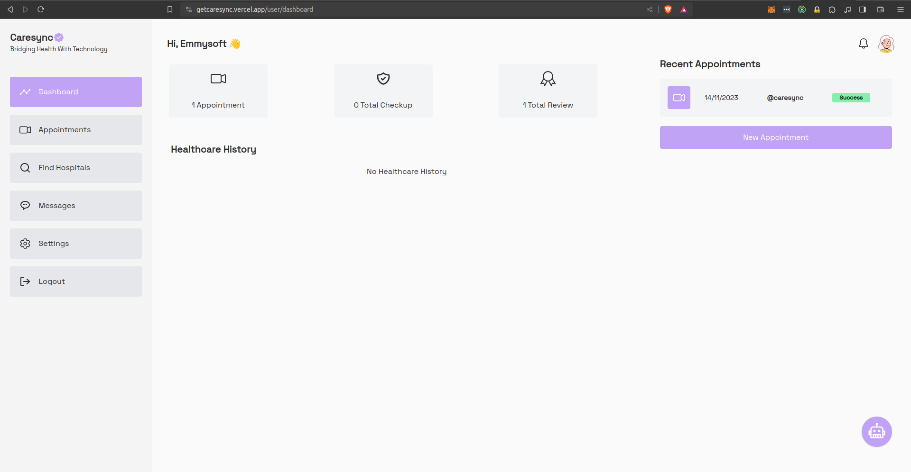

### Appointments
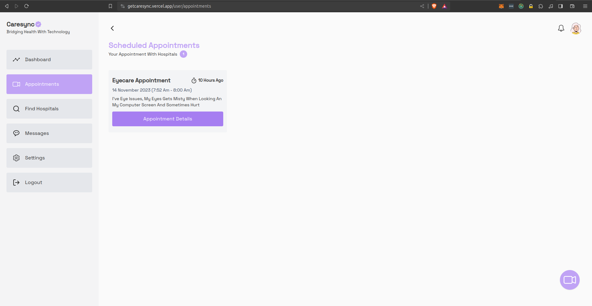

### Search Hospitals
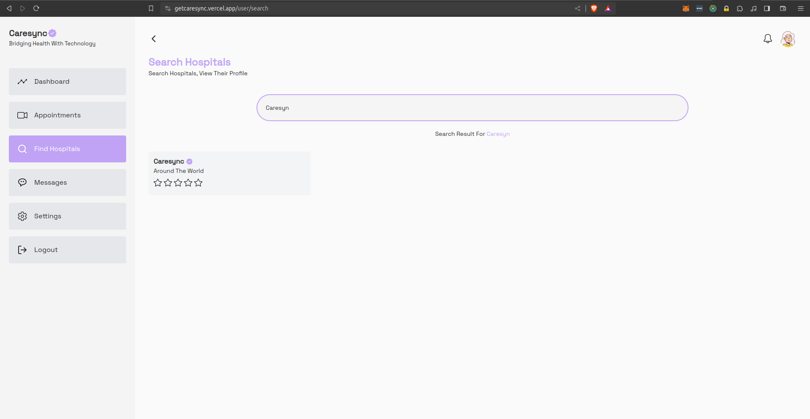

### Hospital Profile
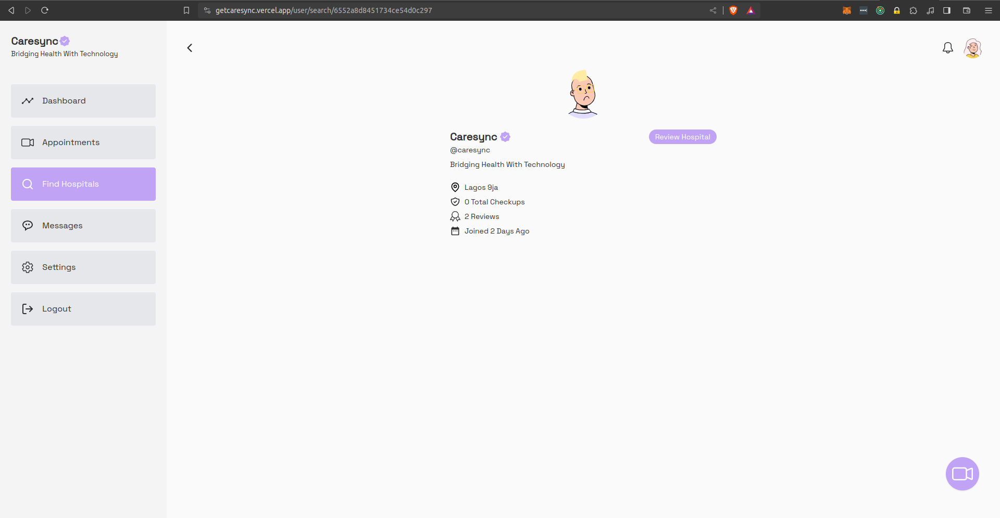

### Messages
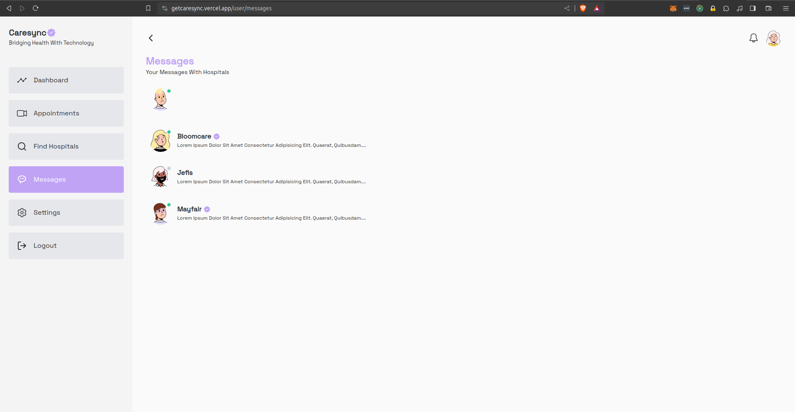

### Message Hospital
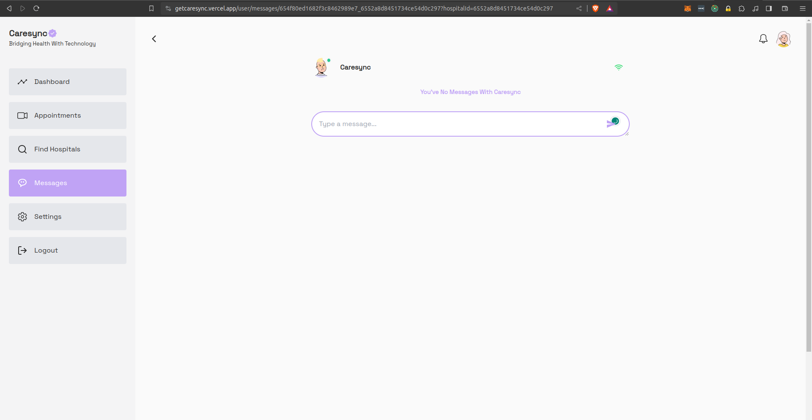

### Message Hospital
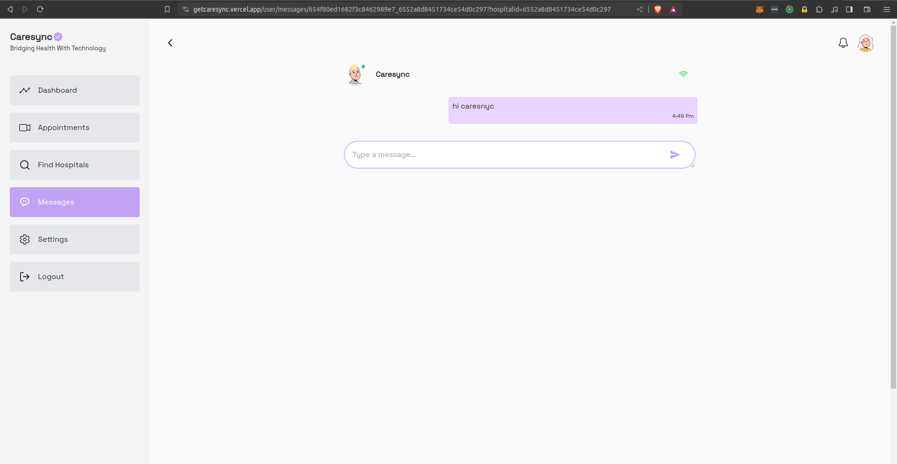

### User Profile
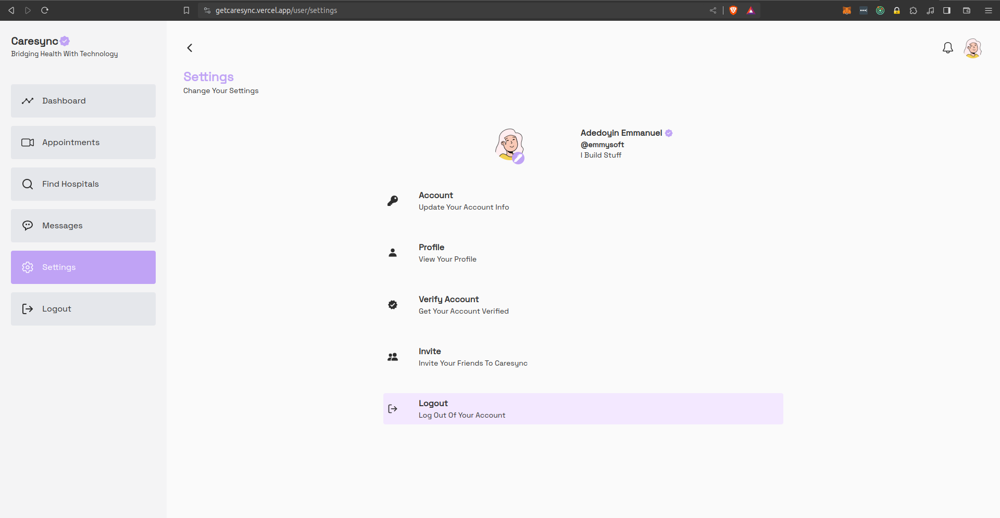

### Specific Appointment
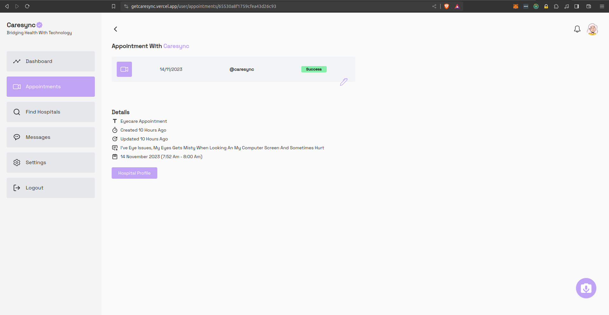

### Submit Hospital Review
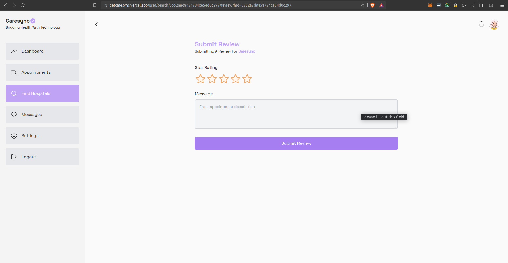

### View All Reviews Made
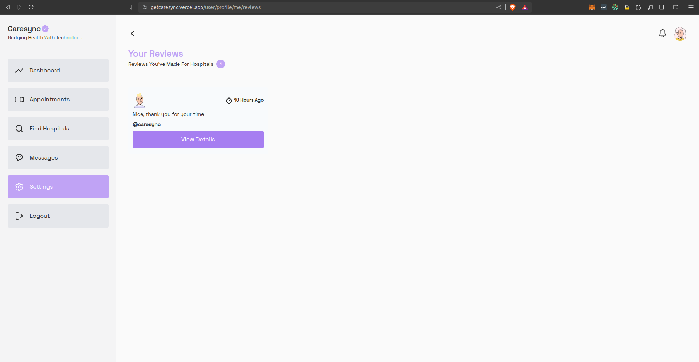

### Hospital Mini Profile
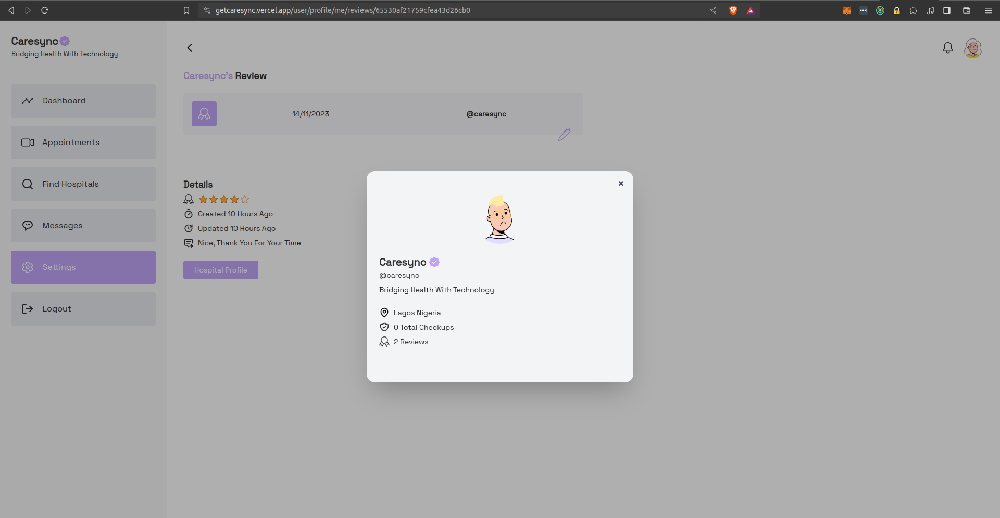